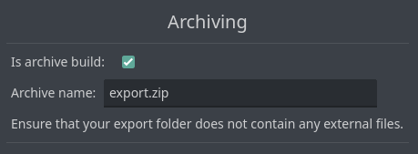

# Archiving
In the WebBus tab of the main menu, you can enable automatic archiving of the exported web build and specify a name for the archive. 

!!! WARNING
    Make sure there are no third-party files in the export folder.